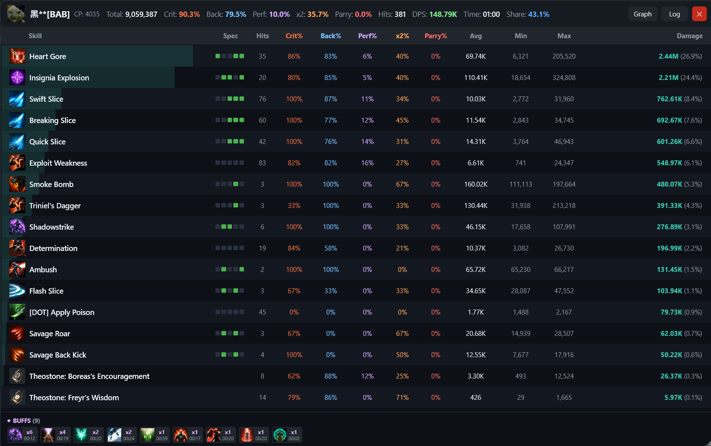
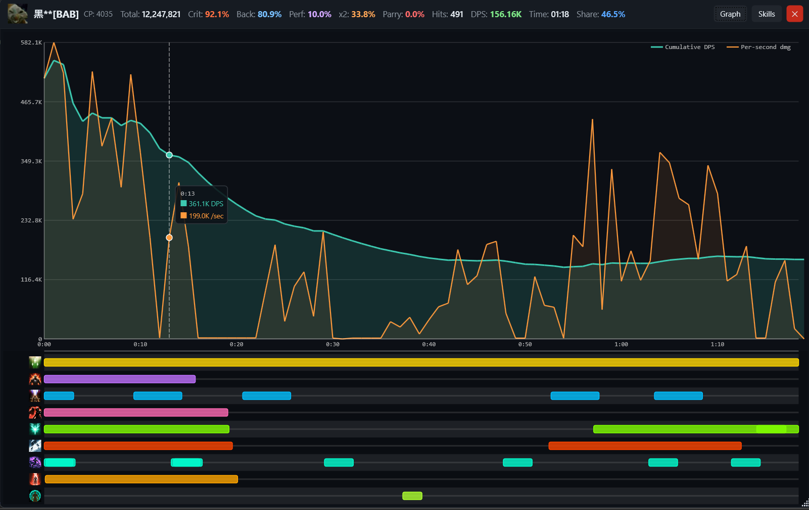
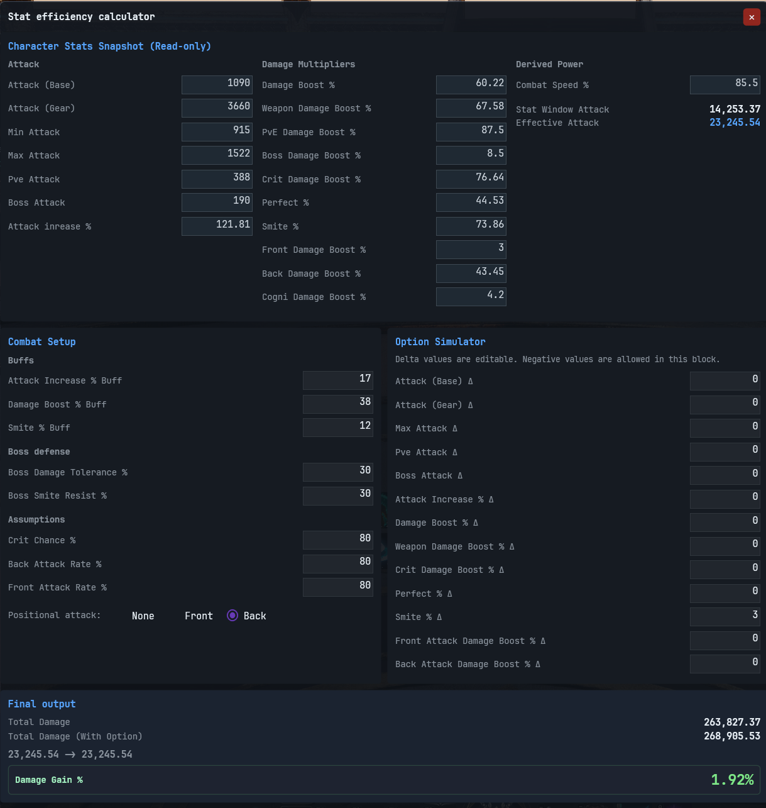

# 🗡️ Aion 2 DPS Meter

[](https://github.com/Kuroukihime/AIon2-Dps-Meter/tags)
[](#)
[](#)
[](#)
[](LICENSE)

A lightweight, **network-based** DPS meter for **Aion 2 Global**. It passively reads game packets off your network interface — it does **not** modify, inject into, or interact with the game client or server in any way.

> **⚠️ Disclaimer:** This tool only reads network traffic on your local machine. It does not inject code, modify memory, or communicate with any external service. All combat logs and data remain strictly on your local machine; this tool does not share, upload, or transmit any data to external resources. Use at your own discretion and in accordance with the game's terms of service.

---

## ✨ Features

- **📊 Real-Time DPS Tracking** — live DPS & total damage per player, contribution bars, party DPS, auto session reset
- **🎯 Smart Target Tracking** — auto-detects your current target with name, HP and a live HP bar
- **📶 Ping Monitor** — colour-coded live ping (🟢 <60ms · 🟡 60–99ms · 🟠 100–199ms · 🔴 ≥200ms)
- **🔍 Detailed Player Stats** — per-player breakdown: crit/back-attack/perfect-hit/parry rates, skill-by-skill damage, buffs, DPS graph with buff timeline, live combat log
- **📜 Combat History** — every fight auto-saved as a session snapshot, browsable with configurable retention
- **🔔 Buff & Skill Cooldown Overlays** — floating overlays tracking up to 10 buffs + 10 skill cooldowns, with a pick-list to choose exactly what to track, sortable by time remaining, adjustable icon size (20–50px), and each overlay can be toggled independently
- **🙈 Nickname Hiding** — mask player names for streaming/screenshots
- **💾 Persistent Settings** — window layout & preferences saved automatically

<table>
<tr>
<td width="50%"></td>
<td width="50%"></td>
</tr>
<tr>
<td width="50%"></td>
<td width="50%"></td>
</tr>
<tr>
<td width="50%"></td>
<td width="50%"></td>
</tr>
</table>

---

## ⚔️ Stat Efficiency Calculator

Simulate stat changes and see their exact damage impact **before** committing them in-game. Pulls a read-only snapshot of your current Attack stats and derived power, then lets you layer combat assumptions (crit chance, front/back attack rate, positional stance) on top. Enter deltas for any stat and instantly see **Total Damage**, **Total Damage (With Option)**, and overall **Damage Gain %** — so you know if a gear swap or buff is actually worth it.

<p align="center"></p>

---

## 📦 Installation

1. Install **[Npcap](https://npcap.com/#download)** — during setup, check **"Install Npcap in WinPcap API-compatible Mode"** (required).
2. Download the latest `.zip` from the **[Releases](../../releases)** page and extract it anywhere.
3. Run **`AionDpsMeter.UI.exe`** and launch Aion 2 — tracking starts automatically.

> You may need to run as **Administrator** depending on your system's packet-capture permissions.

---

## ❓ FAQ

**Q: Why is my nickname displayed as `Player_xxxx`?**
 - The server does not include player nicknames in damage packets. A nickname is only sent in specific events, such as teleporting or entering a dungeon. Until one of those events occurs, the meter displays a placeholder name.

**Q: Why are some summon skills registered as a separate unknown entity?**
 - This is a rare edge case. It happens when a summon is spawned outside your render range, meaning the meter missed the summoning event and could not link the summon's ID to the owning player.


---

<details>
<summary>🛠️ <b>Developer Build Guide</b></summary>

### Prerequisites

| Tool | Version |
|------|---------|
| [.NET SDK](https://dotnet.microsoft.com/download) | 10.0+ |
| Visual Studio 2022 (or Rider) | Latest |
| [Npcap](https://npcap.com/#download) | Latest, WinPcap-compatible mode |
| Git | Any recent |

### Build

```bash
git clone https://github.com/Kuroukihime/AIon2-Dps-Meter.git
cd AIon2-Dps-Meter
dotnet restore
dotnet build
```

### Self-contained release

```bash
dotnet publish AionDpsMeter.UI/AionDpsMeter.UI.csproj ^
  -c Release ^
  -r win-x64 ^
  --self-contained true ^
  -p:PublishSingleFile=true ^
  -o ./publish
```

### Project structure

```
AionDpsMeter.sln
├── AionDpsMeter.Core        # Domain models, game data (skills, classes, mobs)
├── AionDpsMeter.Services    # Packet capture, TCP stream parsing, session management
└── AionDpsMeter.UI          # WPF front-end, view models, windows
```

Open `AionDpsMeter.sln`, set **AionDpsMeter.UI** as startup project, press **F5** (run as Administrator if packet capture fails to start).

</details>

---

## 🙏 Credits

- **Game data reverse engineering** — huge thanks to [**@taengu**](https://github.com/taengu/) and  [**@Karim**](https://github.com/karim-mo/) for helping reverse-engineer Aion 2 game data.
- **Mobs and Skills database** — [**@Karim**](https://github.com/karim-mo/)
- Built with [**SharpPcap**](https://github.com/dotpcap/sharppcap) and [**Packet.Net**](https://github.com/dotpcap/packetnet) for packet capture.
- UI built with **WPF** on **.NET 10** using [**CommunityToolkit.Mvvm**](https://github.com/CommunityToolkit/dotnet).

## 📧 Contact

Kuroyukihimexdd@proton.me

## 📄 License

See [LICENSE](LICENSE).
